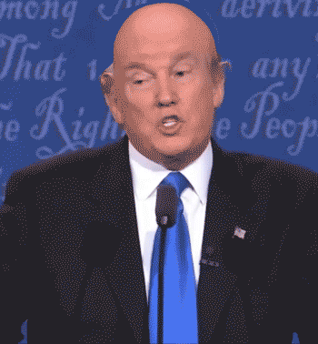

# Samson
Bald Trump in realtime. Used to [baldstream](https://youtu.be/2Ft5JBWj_Ag?t=4814) the final 2016 presidential debate on October 19, 2016.

This app is built using [OpenFrameworks](http://openframeworks.cc), an open-source arts-engineering toolkit.

Functions:

- stream video from a Blackmagic screen recorder OR play recorded video
- recognize a split screen or full screen shot to identify and focus in on Trump
- extract the foreground of the image, given a background of relatively constant cool luminance
- do facial recognition using Kyle McDonald's [ofxFaceTracker](https://github.com/kylemcdonald/ofxFaceTracker) (follow setup instructions there to properly setup the addon)
- remove his hair and fill it in with the median background color
- render a bald 3d model in the same orientation as his face
- blend Trump's face into the rendered model
- output the video texture over syphon

Many thanks to Golan Levin.